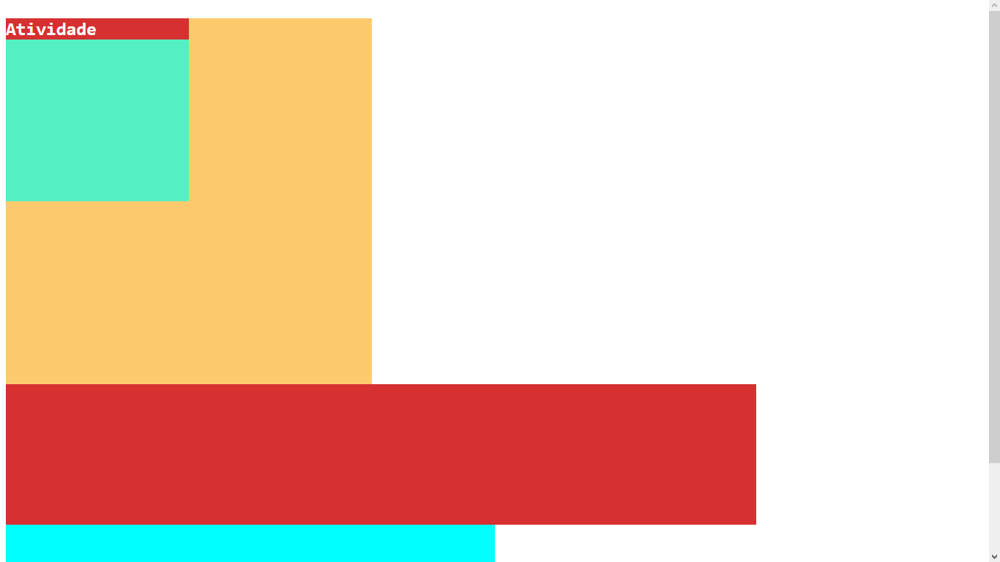

<h1 align="center"> Pesquisa e Inovação - Atividade 01 </h1>

  

 

  <h3>Web</h3>
  

## 🚀 Tecnologias

Esse projeto foi desenvolvido com as seguintes tecnologias:

- HTML
- CSS

## 💻 Projeto

Este projeto é uma das atividades propostos na aula de Pesquisa e Inovação da faculdade.